# Modelo de autenticação usando Node e React com typescript

## Descrição
Modelo de autenticação aplicando os conceitos de **Token** e **Refresh Token**, 
**Silent Refresh** e com um fluxo de autenticação **bem definido**.

 <a href="#ferramentas-e-tecnologias">Ferramentas</a> •
 <a href="#principais-libs">Libs</a> • 
 <a href="#fluxo-de-autenticação">Fluxo</a>

## Ferramentas e Tecnologias

    
    
    

## Principais Libs
[Axios](https://axios-http.com/ptbr/docs/intro) no FrontEnd.  
[Fastify](https://axios-http.com/ptbr/docs/intro) no BackEnd.

## Fluxo de Autenticação

```mermaid
sequenceDiagram
    participant CLIENTE
    participant SERVIDOR
    CLIENTE->>SERVIDOR: Enviar Access Token
    SERVIDOR->>SERVIDOR: Verifica Token
    alt Token Válido
        SERVIDOR-->>CLIENTE: Retorna Dados Normais
    else Token Inválido
        SERVIDOR-->>CLIENTE: Retorna Erro
        CLIENTE->>CLIENTE: MiddleAuth: Processa Erro 
        alt Tipo de Erro: Access Token Inválido
            CLIENTE->>SERVIDOR: Atualizar Token
        else Outro Tipo de Erro
            CLIENTE->>CLIENTE: Redireciona para Pagina Login
        end
    end
```

<h4> 
	🚧  Estilização 🚀 Em construção...  🚧
</h4>
<h4> 
	🚧  Gerenciamento dos Dados 🚀 Em construção...  🚧
</h4>
<h4> 
	🚧  Otimização 🚀 Em construção...  🚧
</h4>
<h4> 
	✅ Comunicação entre Estruturas 🎇 Concluída ✅
</h4>
<h4> 
	✅ Fluxo de Autenticação 🎇 Concluído ✅
</h4>

          